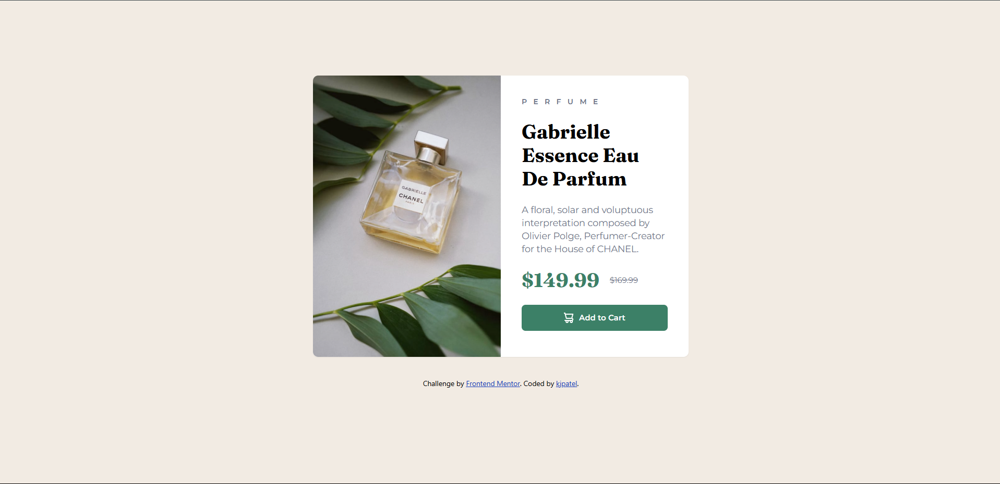

# Product preview card component solution

This is a solution to the [Product preview card component challenge on Frontend Mentor](https://www.frontendmentor.io/challenges/product-preview-card-component-GO7UmttRfa). Frontend Mentor challenges help you improve your coding skills by building realistic projects. 

## Table of contents

- [Overview](#overview)
  - [Screenshot](#screenshot)
  - [Links](#links)
  - [Built with](#built-with)
  - [What I learned](#what-i-learned)
- [Author](#author)

## Overview

### Screenshot

### Links

- [Live](https://kirtanpatel01.github.io/product-preview-card/)

## My process

### Built with

- HTML5
- Tailwind CSS

### What I learned

To make responsive layout you don't need to use too many breakpoints by using few ones and dynamic layout you can achieve responsiveness. I just hide the desktop image and visible mobile image on small screens I thought I'll have to work on other typography and spacing but no everything is already fine without doing too much. 

## Author

- Website - [KJ_Patel Portfolio](https://kirtanpatel01.github.io/ARKA_WD_04)
- Frontend Mentor - [@kirtanpatel01](https://www.frontendmentor.io/profile/kirtanpatel01)
- Linkedin - [@kirtapatel01](https://www.linkedin.com/in/kirtanpatel01)
